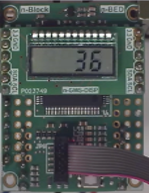
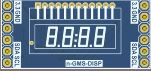
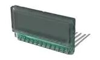

# nGLCD 
LCD Driver Node for N-GLCD n-Block: displays on LCD data received on input.
When the input is triggered, the value on the input, split into individual digits (BCD) to display in the correct position on the nGLCD n-Block board (Ultra Low Power PCA8561 I2C driver and S401M16KR LCD)

## Parameters:
 *  PinName: pinSDA
 *  PinName: pinSCL
 *  char: I2C address
 *  char: Leading zeros

## Inputs:
 *  Integer: Value:

## Example:
[Ticker]-->[Counter]-->[nGLCD]

## Links
 *  https://github.com/nBlocksStudioNodes/nblocks_nGLCD
 *  https://www.youtube.com/watch?v=Vm655T1XvKE
 

## nGLCD nBlock

  

n-GLCD n-Block contains:  
 *  [PCA8561](https://www.nxp.com/products/peripherals-and-logic/lcd-drivers/lcd-segment-drivers/automotive-18-x-4-lcd-segment-driver:PCA8561) 18 × 4 LCD segment driver  
 *  Lumex [LCD-S401M16KR](https://www.lumex.com/datasheet/LCD-S401M16KR) 4 Digit 0.17" 7 Segment, Custom LCD Panel, TN, Reflective, 0℃~50℃, 6:00 View 3V AC

*Authors: Ian Aherne, N. Chalikias* 
 

