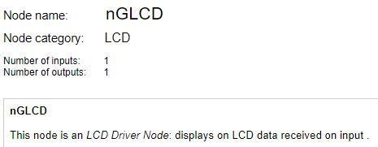
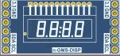
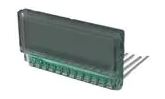

 # nBlocksStudio nGLCD
 ## NODE
 

This node is an LCD Driver Node for N-GLCD n-Block: displays on LCD data received on input.  

n-GLCD n-Block contains:  
PCA8561 18 × 4 LCD segment driver  
and  
Lumex LCD-S401M16KR

nBlock_Lcd :: nBlock_Lcd(PinName SDA, PinName SCL,char slave_address,char leading_zeros)  
 

Author: Ian Aherne  
